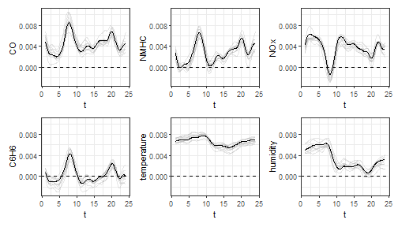

<style>
body {
text-align: justify}
</style>


# Control charts for monitoring a scalar response variable and multivariate functional covariates based on scalar-on-function regression

In this vignette we show how to use the `funcharts` package to apply the methods proposed in Capezza et al. (2020) to build control charts for monitoring a scalar response variable and multivariate functional covariates based on scalar-on-function regression.
Let us show how the `funcharts` package works through an example with the dataset `air`,
which has been included from the R package `FRegSigCom` and is used in the paper of Qi and Luo (2019).
The authors propose a function-on-function regression model of the `NO2` functional variable on all the other functional variables available in the dataset.
In order to show how the package works, we consider a scalar-on-function regression model, where we take the mean of `NO2` at each observation as the scalar response and all other functions as functional covariates.

NOTE: since the objective of this vignette is only to illustrate how the package works, in the following we will use only 15 basis functions and a fixed smoothing parameter to reduce the computational time.

First of all, starting from the discrete data, let us build the multivariate functional data objects of class `mfd`, see `vignette("mfd")`.


```r
library(funcharts)
data("air")
fun_covariates <- names(air)[names(air) != "NO2"]
mfdobj_x <- get_mfd_list(air[fun_covariates],
                       grid = 1:24,
                       n_basis = 15,
                       lambda = 1e-2)
```

Then, we extract the scalar response variable, i.e. the mean of `NO2` at each observation:


```r
y <- rowMeans(air$NO2)
```

In order to perform the statistical process monitoring analysis, we divide the data set into a phase I and a phase II dataset.


```r
rows1 <- 1:300
rows2 <- 301:355
mfdobj_x1 <- mfdobj_x[rows1]
mfdobj_x2 <- mfdobj_x[rows2]
y1 <- y[rows1]
y2 <- y[rows2]
```


## Scalar-on-function regression based on principal components

We can build a scalar-on-function linear regression model where the response variable is a linear function of the multivariate functional principal components scores.
The components to retain in the model can be selected with `selection` argument.
Three alternatives are available (default is `variance`):

* if "variance", the first M multivariate functional principal components are retained into the MFPCA model such that together they explain a fraction of variance greater than `tot_variance_explained`,
* if "PRESS", each j-th functional principal component is retained into the MFPCA model if, by adding it to the set of the first j-1 functional principal components, then the predicted residual error sum of squares (PRESS) statistic decreases, and at the same time the fraction of variance explained by that single component is greater than `single_min_variance_explained.` This criterion is used in Capezza et al. (2020).
* if "gcv", the criterion is equal as in the previous "PRESS" case, but the "PRESS" statistic is substituted by the generalized cross-validation (GCV) score.


```r
mod <- sof_pc(y = y1,
              mfdobj_x = mfdobj_x1,
              selection = "PRESS",
              single_min_variance_explained = .01)
```

As a result you get a list with the original data used for model estimation, the result of applying `pca_mfd` on the multivariate functional covariates, the estimated regression model.
It is possible to plot the estimated functional regression coefficients, which is also a multivariate functional data object of class `mfd`:


```r
plot_mfd(mod$beta)
```


Moreover bootstrap can be used to obtain uncertainty quantification:


```r
plot_bootstrap_sof_pc(mod, nboot = 10)
```




## Control charts

We can build control charts to monitor both functional covariates and the scalar response.
We can either monitor the functional covariates alone (unsupervised monitoring) or the functional covariates and the scalar response together (supervised monitoring), as performed in Capezza et al. (2020).

### Unsupervised monitoring

The function `control_charts_pca` provides a data frame with all the information required to plot the desired control charts on multivariate functional data, based on the Hotelling's T^2 and the squared prediction error statistics (see Capezza et al. (2020) and Centofanti et al. (2020)).
Among the arguments, you can pass a `tuning_data` set, that is not used for model estimation/training, but is used only
to estimate control chart limits.
If this data set is not provided, control chart limits are calculated on the basis of the training data.
The argument `newdata` contains the phase II data set of observations of multivariate functional covariates,
that are to be monitored with the control charts.
The function `plot_control_charts` returns a ggplot with the control charts.


```r
cclist_pca <- control_charts_pca(pca = mod$pca,
                                 components = mod$components,
                                 newdata = mfdobj_x2)
plot_control_charts(cclist_pca)
```


### Supervised monitoring


The function `control_charts_sof_pc` provides a data frame with all the information required to plot the desired control charts. In addition to the Hotelling's T^2 and the squared prediction error statistics obtained using `control_charts_pca` (see previous section), this function provides the scalar regression control charts, which also monitors the prediction error on the response variable.
The same function `plot_control_charts` can be used to obtain ggplot with the three control charts.
As for unsupervised monitoring, you can pass a `tuning_data` set (see previous section).


```r
cclist_sof_pc <- control_charts_sof_pc(mod = mod,
                                       y_test = y2,
                                       mfdobj_x_test = mfdobj_x2)
plot_control_charts(cclist_sof_pc)
```


## Fault detection

Once an out-of-control observation is identified in a control chart,
one can obtain the contribution of the functional covariates to the monitoring statistics to understand
which variable was possibly responsible of the anomalous observation.

We can get the out of control observations using `which_ooc`.
In the following, we focus on the supervised monitoring.


```r
ooc_index <- which_ooc(cclist_sof_pc)
ooc_index
#> $T2
#>    n  id
#> 1  5 305
#> 2 12 312
#> 
#> $spe
#>   n  id
#> 1 9 309
#> 
#> $y
#>    n  id
#> 1 29 329
#> 2 52 352
#> 3 53 353
#> 4 54 354
#> 5 55 355
```


From the control charts it is possible to see some phase II observations out of control.
For example, let us consider observation 9. We can exploit the contribution plots using the function `cont_plot` to identify the variables responsible of the anomaly.
The contributions are plotted as bar plots, against upper control limits estimated empirically on the training data.


```r
cont_plot(cclist_sof_pc, 9)
```


Finally, we can also plot any multivariate functional observation against a reference data set by using the function `plot_mon`:


```r
plot_mon(cclist_sof_pc, mfdobj_x1, mfdobj_x2[9])
```


This helps to understand which part of the observations were anomalous. Variables exceeding contribution plot limits are coloured in red.


## Real-time monitoring

In Capezza et al. (2020), we have also implemented real-time monitoring (both unsupervised and supervised).
Given the domain interval $(a, b)$ of the functional data, for each current domain point $k$ to be monitored, it filters the available functional data in the interval $(a,k)$.
The function `get_mfd_list_real_time` gives a list of functional data objects each evolving up to the intermediate domain point $k$.


```r
mfd_list <- get_mfd_list_real_time(
  data_list = air[fun_covariates],
  grid = 1:24,
  n_basis = 15,
  lambda = 1e-2,
  k_seq = seq(0.5, 1, length.out = 7))
mfd_list1 <- lapply(mfd_list, function(x) x[rows1])
mfd_list2 <- lapply(mfd_list, function(x) x[rows2])
```

Then, the function `sof_pc_real_time` applies the function `sof_pc` to each element in `mfd_list1`.


```r
mod_list <- sof_pc_real_time(y = y1, mfd_real_time_list = mfd_list1)
```

Then, we can use `control_charts_sof_pc_real_time` to apply `control_charts_sof_pc` to each element in `mod_list` and produce control charts for the phase II data `mfd_list2` and `y2`.


```r
cc_list_real_time <- control_charts_sof_pc_real_time(
  mod_list = mod_list,
  y_test = y2,
  mfdobj_x_test = mfd_list2
)
```

Finally, we can plot the real-time control charts for a single observations, giving for each $k$ the monitoring statistics calculated on the data observed in $(a, k)$.
Here follows an example showing the real time control charts for a single phase II observation (id number 9).


```r
plot_control_charts_real_time(cc_list_real_time, id_num = 9)
#> Warning: `guides(<scale> = FALSE)` is deprecated. Please use `guides(<scale> = "none")` instead.

#> Warning: `guides(<scale> = FALSE)` is deprecated. Please use `guides(<scale> = "none")` instead.

#> Warning: `guides(<scale> = FALSE)` is deprecated. Please use `guides(<scale> = "none")` instead.
```


# References

* Capezza C, Lepore A, Menafoglio A, Palumbo B, Vantini S. (2020)
Control charts for monitoring ship operating conditions and CO2
emissions based on scalar-on-function regression.
*Applied Stochastic Models in Business and Industry*,
36(3):477--500. https://doi.org/10.1002/asmb.2507
* Qi X, Luo R. (2019).
Nonlinear function-on-function additive model with multiple predictor curves.
*Statistica Sinica*, 29:719--739. https://doi.org/10.5705/ss.202017.0249
