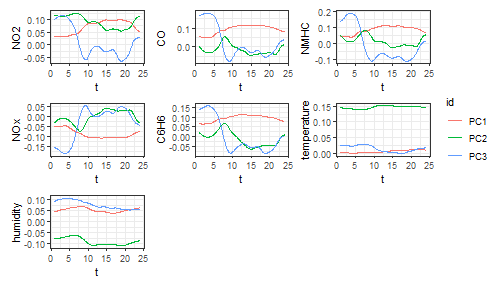
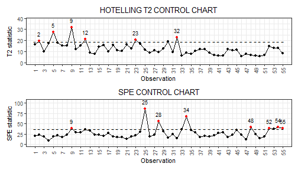
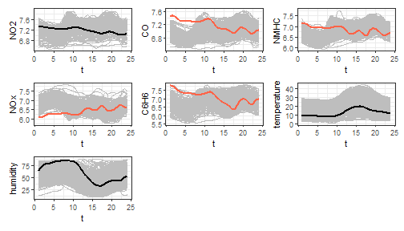

<style>
body {
text-align: justify}
</style>


# Functional control charts for multivariate quality characteristics

In this vignette we show how to use the `funcharts` package to apply the methods proposed in Colosimo and Pacella et al. (2010) to build control charts for monitoring a multivariate functional quality characteristic.
Let us show how the `funcharts` package works through an example with the dataset `air`.

First of all, starting from the discrete data, let us build the multivariate functional data objects of class `mfd`, see `vignette("mfd")`.


```r
library(funcharts)
data("air")
mfdobj <- get_mfd_list(air, grid = 1:24)
nobs <- dim(mfdobj$coefs)[2]
nobs
#> [1] 355
plot_mfd(mfdobj)
```


In order to perform the statistical process monitoring analysis, we divide the data set into a phase I and a phase II dataset.


```r
rows1 <- 1:300
rows2 <- 301:355
mfdobj1 <- mfdobj[rows1]
mfdobj2 <- mfdobj[rows2]
```


## Multivariate functional principal component analysis

For class `mfd` we provide a function `pca_mfd`, which is a wrapper to `pca.fd`.
It returns multivariate functional principal component scores summed over variables (`fda::pca.fd` returns an array of scores when providing a multivariate functional data object).
Moreover, the eigenfunctions or multivariate functional principal components given in `harmonics` argument are converted to the `mfd` class.
We also provide a plot function for the eigenfunctions (the argument `harm` selects which components to plot).


```r
pca <- pca_mfd(mfdobj1)
plot_pca_mfd(pca, harm = 1:3)
```




## Control charts

The function `control_charts_pca` provides a data frame with all the information required to plot the desired control charts on multivariate functional data, based on the Hotelling's $T^2$ and the squared prediction error statistics (see Colosimo and Pacella (2010), Capezza et al. (2020)).
Among the arguments, you can pass a `tuning_data` set, that is not used for model estimation/training, but only to estimate control chart limits.
If this data set is not provided, control chart limits are calculated on the basis of the training data.
The argument `newdata` contains the phase II data set of observations of multivariate functional covariates to be monitored.
The function `plot_control_charts` returns the plot of the control charts.


```r
cclist_pca <- control_charts_pca(pca = pca, newdata = mfdobj2)
plot_control_charts(cclist_pca)
```




## Fault detection

Once an out-of-control observation is identified in a control chart,
one can obtain the contribution of the functional covariates to the monitoring statistics to understand
which variable was possibly responsible of the anomalous observation.

We can get the out of control observations using `which_ooc`.


```r
ooc_index <- which_ooc(cclist_pca)
ooc_index
#> $T2
#>    n  id
#> 1  2 302
#> 2  5 305
#> 3  9 309
#> 4 12 312
#> 5 23 323
#> 6 32 332
#> 
#> $spe
#>    n  id
#> 1  9 309
#> 2 25 325
#> 3 28 328
#> 4 34 334
#> 5 48 348
#> 6 52 352
#> 7 54 354
#> 8 55 355
```


From the control charts it is possible to see some phase II observations out of control.
For example, let us consider observation 9.
We can exploit the contribution plots using the function `cont_plot` to identify the variables responsible of the anomaly.
The contributions are plotted as bar plots, against upper control limits estimated empirically on the training data.


```r
cont_plot(cclist_pca, 9)
```


Finally, we can also plot any multivariate functional observation against a reference data set by using the function `plot_mon`:


```r
plot_mon(cclist_pca, fd_train = mfdobj1, fd_test = mfdobj2[9])
```


This helps to understand which profiles were anomalous.
Variables exceeding contribution plot limits are coloured in red.

# References

* Colosimo, BM Pacella, M. (2010) A comparison study of control charts for statistical monitoring of functional data. *International Journal of Production Research*, 48(6), 1575-1601. https://doi.org/10.1080/00207540802662888
* Capezza C, Lepore A, Menafoglio A, Palumbo B, Vantini S. (2020)
Control charts for monitoring ship operating conditions and CO2
emissions based on scalar-on-function regression.
*Applied Stochastic Models in Business and Industry*,
36(3):477--500. https://doi.org/10.1002/asmb.2507

