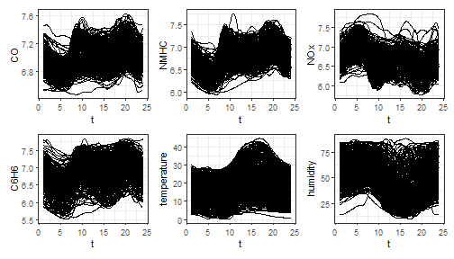
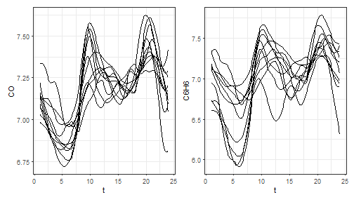
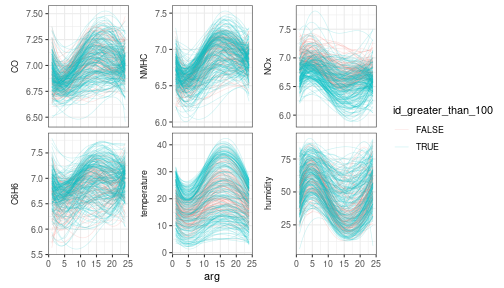
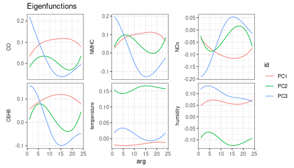

<style>
body {
text-align: justify}
</style>


# The `mfd` class

Let us show how the `funcharts` package works through an example with the dataset `air`,
which has been included from the R package `FRegSigCom` and is used in the paper of Qi and Luo (2019).

NOTE: since the objective of this vignette is only to illustrate how the package works, in the following we will use only 5 basis functions and a fixed smoothing parameter to reduce the computational time.


## Getting multivariate functional data and the `mfd` class

We provide the `mfd` class for multivariate functional data.
It inherits from the `fd` class but provides some additional features:

* It forces the `coef` argument to be an array even when the number of functional observations and/or the number of functional variables are one
* It provides a better subset function `[` that never drops dimensions, then it always returns a `mfd` object with three-dimensional array argument `coef`; moreover it allows extracting observations/variables also by name
* When possible, it stores the original raw data in the long data frame format

The first thing is to get the `mfd` object from discrete data.
We currently allow two types of input with the two functions:

1. `get_mfd_data.frame`: first input must be a data.frame in the long format, with:
    * one `arg` column giving the argument (`x`) values,
    * one `id` column indicating the functional observation,
    * one column per each functional variable indicating the corresponding `y` values
2. `get_mfd_list`: first input must be a list of matrices for the case all functional data are observed on the same grid, which:
    * must have all the same dimension,
    * have the variable names as name of the list,
    * are such that, for each matrix:
        * each row corresponds to a functional observation
        * each column corresponds to a point on the grid

In this example, the dataset `air` is in the second format (list of matrices, with data observed on the same grid)


```r
library(funcharts)
data("air")
fun_covariates <- names(air)[names(air) != "NO2"]
mfdobj_x <- get_mfd_list(air[fun_covariates],
                         grid = 1:24,
                         n_basis = 5,
                         lambda = 1e-2)
```

In order to perform the statistical process monitoring analysis, we divide the dataset into a phase I and a phase II dataset.


```r
rows1 <- 1:300
rows2 <- 301:355
mfdobj_x1 <- mfdobj_x[rows1]
mfdobj_x2 <- mfdobj_x[rows2]
```

Now we extract the scalar response variable, i.e. the mean of `NO2` at each observation:


```r
y <- rowMeans(air$NO2)
y1 <- y[rows1]
y2 <- y[rows2]
```


## Plotting functions

We also provide plotting functions using ggplot2.


```r
plot_mfd(mfdobj_x1)
```



```r
plot_mfd(mfdobj_x1[1:10, c("CO", "C6H6")])
```



This functions provides a layer `geom_mfd`, which is basically a `geom_line` that is added to `ggplot()` to plot functional data.
It also allows to plot the original raw data by adding the argument `type_mfd = "raw"`.
`geom_mfd` accepts the argument `data` as input, which must be a data frame with two columns, `id` and `var`, in order to use aesthetic mappings that allow for example to colour different functions according to some columns in this data frame.


```r
dat <- data.frame(id = unique(mfdobj_x1$raw$id)) %>%
  mutate(id_greater_than_100 = as.numeric(id) > 100)
ggplot() +
  geom_mfd(mapping = aes(col = id_greater_than_100),
           mfdobj = mfdobj_x1,
           data = dat,
           alpha = .2,
           lwd = .3)
```



## Multivariate functional principal component analysis

For class `mfd` we provide a function `pca_mfd`, which is a wrapper to `pca.fd`.
It returns multivariate functional principal component scores summed over variables (`fda::pca.fd` returns an array of scores when providing a multivariate functional data object).
Moreover, the eigenfunctions or multivariate functional principal components given in `harmonics` argument are converted to the `mfd` class.
We also provide a plot function for the eigenfunctions (the argument `harm` selects which components to plot).


```r
pca <- pca_mfd(mfdobj_x1)
plot_pca_mfd(pca, harm = 1:3)
```


